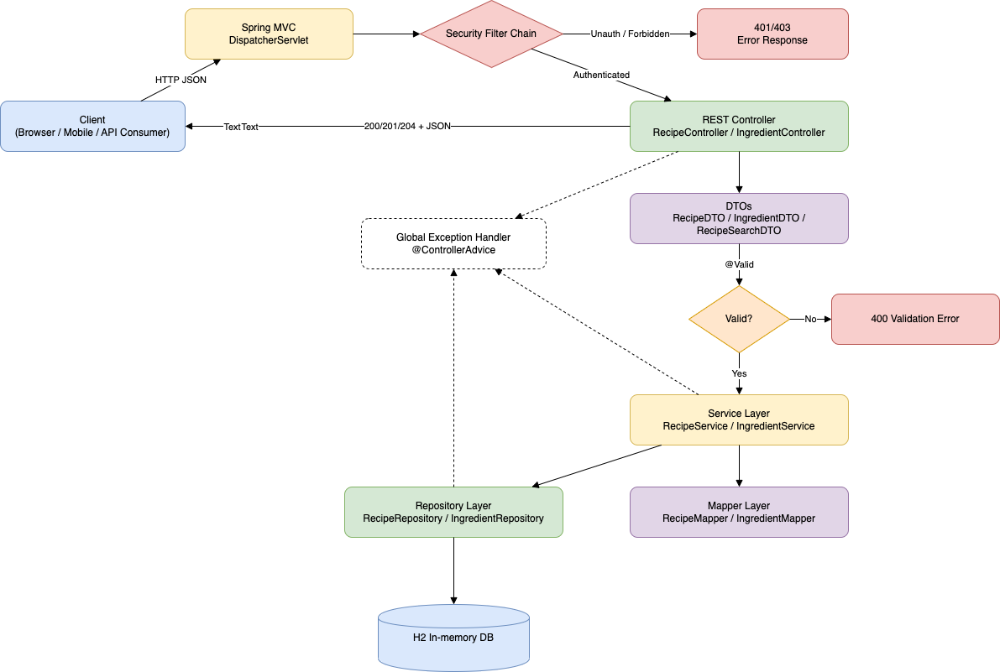

# Architecture & Design Documentation

## System Overview

The Recipe Management Service is a RESTful web application built with Spring Boot that provides comprehensive recipe and ingredient management capabilities with advanced filtering features.

## High-level Design

### High-level Design Diagram (image)





## Architectural Pattern

### Layered Architecture

The application follows a traditional three-tier layered architecture:

```
┌───────────────────────────────────────┐
│      API Layer (Controller)           │
│   - HTTP Request/Response Handling    │
│   - Input Validation                  │
│   - OpenAPI Annotations               │
└──────────────────────┬────────────────┘
                       │
┌──────────────────────▼────────────────┐
│    Business Logic Layer (Service)     │
│   - Recipe CRUD Operations            │
│   - Ingredient CRUD + search          │
│   - Complex Filtering Logic           │
│   - Transaction Management            │
└──────────────────────┬────────────────┘
                       │
┌──────────────────────▼────────────────┐
│   Data Access Layer (Repository)      │
│   - Spring Data JPA Integration       │
│   - Paging/Sorting Queries            │
└──────────────────────┬────────────────┘
                       │
┌──────────────────────▼────────────────┐
│      Database (H2 In-Memory)          │
│   - recipes                           │
│   - ingredients                       │
│   - recipe_ingredients (join table)   │
└───────────────────────────────────────┘
```

## Architecture Decisions (Scalability, Robustness, Networking)

### ADR-01: Stateless API for horizontal scaling
**Decision**: Controllers/services remain stateless to support horizontal scaling behind a load balancer.

### ADR-02: DTO boundary for API contracts
**Decision**: Public API uses DTOs; persistence entities are internal.

### ADR-03: Filtering/search strategy
**Decision**: Current filtering runs in the service layer for demo simplicity.
**Scale-out path**: Move filters to DB queries (Specifications/QueryDSL) and add indexes.

### ADR-04: Resilience and network behavior
**Decision**: Prefer timeouts + bounded resources to avoid cascading failures.
- Keep request timeouts finite.
- Retry only idempotent operations.
- Add circuit breakers if outbound dependencies are introduced.

### ADR-05: Observability
**Decision**: Treat logs/metrics/traces as first-class to diagnose issues under load.

### ADR-06: Pagination as a hard requirement for high-cardinality endpoints
**Decision**: List/search endpoints should be paginated and have sensible defaults/upper bounds.

**Why**
- Prevents large result sets from exhausting heap/CPU and saturating network.
- Keeps latency predictable under load.

**Guidelines**
- Use `page`/`size` with a max `size` cap.
- Return stable ordering (e.g., `id` or `name`) to avoid inconsistent paging.

### ADR-07: Database-first performance under load
**Decision**: When moving beyond demo scale, push filtering to the database and add indexes.

**Why**
- DB query planners + indexes outperform application-side scans.

**Examples**
- Index common search columns (e.g., `ingredient.name`, `recipe.name`).
- Use join-table indexes for `recipe_ingredients(recipe_id, ingredient_id)`.

### ADR-08: Connection pooling and thread/resource limits
**Decision**: Use connection pooling (HikariCP) and keep thread pools bounded.

**Why**
- Prevents thundering herd behavior and protects the DB.

**Operational knobs (typical)**
- Hikari: max pool size, connection timeout.
- Server: max threads, request queue.

### ADR-09: Caching strategy (optional, when read-heavy)
**Decision**: Introduce caching only when profiling shows DB or latency bottlenecks.

**Approach**
- Cache read-most endpoints (e.g., popular recipes) with short TTL.
- Invalidate/refresh on write operations.

**Notes**
- Caching is a correctness trade-off; monitor hit rate and staleness expectations.

### ADR-10: Concurrency control to avoid lost updates
**Decision**: For production-grade concurrency, prefer optimistic locking.

**Scale-out path**
- Add `@Version` columns to mutable entities.
- Optionally expose ETags + `If-Match` for API-level optimistic concurrency.

### ADR-11: Graceful degradation and backpressure
**Decision**: Under overload, protect core flows by shedding/limiting load.

**Mechanisms**
- Rate limiting at gateway/ingress.
- Request size limits.
- Strict timeouts and bounded retries.

### ADR-12: Health checks and readiness for safe rollouts
**Decision**: Provide liveness/readiness probes and fail fast on dependency issues.

**Why**
- Enables Kubernetes/containers to route traffic only to healthy instances.

**Typical signals**
- Liveness: process up.
- Readiness: DB reachable + migration complete.

### ADR-13: Network-level robustness
**Decision**: Assume partial network failures and latency spikes.

**Guidelines**
- Enforce TLS, set keep-alive, use compression for large payloads.
- Use correlation IDs (e.g., `X-Request-Id`) for tracing across hops.

### ADR-14: Security controls at the edge and in-app
**Decision**: Defense-in-depth.

**Edge**
- TLS termination, WAF, rate limiting.

**App**
- AuthN/AuthZ via Spring Security.
- CORS configured explicitly.
- Input validation + safe error responses.

## Design Patterns

### 1. MVC (Model-View-Controller)
- **Model**: DTO and Entity classes represent data
- **View**: JSON responses
- **Controller**: REST controller handling requests

### 2. DAO (Data Access Object)
- Repository interface abstracts database operations
- Spring Data JPA handles implementation

### 3. Service Layer Pattern
- Encapsulates business logic separate from controller
- Promotes testability and reusability
- Transaction management

### 4. DTO (Data Transfer Object)
- `RecipeDTO`: For API input/output
- `RecipeSearchDTO`: For search parameters
- `IngredientDTO`: For ingredient API input/output
- `PagedResponse<T>`: For paginated list responses

### 5. Exception Handling Pattern
- Custom exceptions for domain-specific errors
- Global exception handler for centralized error management
- Consistent error response format

## Core Components

### Entity Layer

#### `Recipe`
- Represents recipe metadata and relationships
- Uses a **many-to-many** relationship with `Ingredient` via `recipe_ingredients`

#### `Ingredient`
- Represents a unique ingredient name
- Reused across recipes

### Repository Layer

#### `RecipeRepository`
- Standard CRUD via `JpaRepository`

#### `IngredientRepository`
- Standard CRUD via `JpaRepository`
- Supports paging/sorting search:
  - contains / startsWith / exact match (case-insensitive)

### Service Layer

#### `RecipeService`
Core business logic:
- `getAllRecipes()`
- `getRecipeById(Long id)`
- `createRecipe(RecipeDTO)`
- `updateRecipe(Long id, RecipeDTO)`
- `deleteRecipe(Long id)`
- `searchRecipes(RecipeSearchDTO)`

Filtering uses in-memory logic for simplicity (fits H2 demo use-cases). Ingredient filters operate on the normalized ingredients relation.

#### `IngredientService`
Core business logic:
- `getIngredientById(Long id)`
- `createIngredient(IngredientDTO)`
- `updateIngredient(Long id, IngredientDTO)`
- `deleteIngredient(Long id)`
- `searchIngredients(q, mode, pageable)` returning `PagedResponse<IngredientDTO>`

### Controller Layer

#### `RecipeController`
REST endpoints:
- `GET /api/v1/recipes`
- `GET /api/v1/recipes/{id}`
- `POST /api/v1/recipes`
- `PUT /api/v1/recipes/{id}`
- `DELETE /api/v1/recipes/{id}`
- `POST /api/v1/recipes/search`

#### `IngredientController`
REST endpoints:
- `GET /api/v1/ingredients` (pagination + sorting + search)
- `GET /api/v1/ingredients/{id}`
- `POST /api/v1/ingredients`
- `PUT /api/v1/ingredients/{id}`
- `DELETE /api/v1/ingredients/{id}`

## Data Model

### Recipes ↔ Ingredients (Many-to-Many)

- `recipes` stores recipe metadata
- `ingredients` stores unique ingredient names
- `recipe_ingredients` maps recipe IDs to ingredient IDs

This avoids repeating ingredient strings in every recipe row and enables richer ingredient-level operations.

## API Design

### RESTful Principles

Recipes:

| Operation | Method | Endpoint | Status Code |
|-----------|--------|----------|------------|
| List All | GET | `/api/v1/recipes` | 200 |
| Get One | GET | `/api/v1/recipes/{id}` | 200 |
| Create | POST | `/api/v1/recipes` | 201 |
| Update | PUT | `/api/v1/recipes/{id}` | 200 |
| Delete | DELETE | `/api/v1/recipes/{id}` | 204 |
| Search | POST | `/api/v1/recipes/search` | 200 |

Ingredients:

| Operation | Method | Endpoint | Status Code |
|-----------|--------|----------|------------|
| List | GET | `/api/v1/ingredients` | 200 |
| Get One | GET | `/api/v1/ingredients/{id}` | 200 |
| Create | POST | `/api/v1/ingredients` | 201 |
| Update | PUT | `/api/v1/ingredients/{id}` | 200 |
| Delete | DELETE | `/api/v1/ingredients/{id}` | 204 |

### Request/Response Format

All communication in JSON format.

**Recipe DTO Structure (current):**
```json
{
  "id": 1,
  "name": "Vegetable Stir Fry",
  "description": "A quick and healthy meal",
  "isVegetarian": true,
  "servings": 4,
  "ingredients": ["broccoli", "carrots", "garlic"],
  "instructions": "Heat oil. Add vegetables. Stir fry."
}
```

**Ingredient List Response (paged):**
```json
{
  "content": [{"id": 1, "name": "garlic"}],
  "page": 0,
  "size": 20,
  "totalElements": 34,
  "totalPages": 2,
  "first": true,
  "last": false,
  "sort": "name: ASC"
}
```

## Developer Conventions

### Mapping (Entity ↔ DTO)
Entity/DTO mapping is handled via dedicated mapper components:
- `com.recipe.mapper.RecipeMapper`
- `com.recipe.mapper.IngredientMapper`

Service layer uses these mappers for conversions and for applying basic DTO updates onto entities.
Repository lookups (e.g., resolving ingredient names into entities) remain in the service layer.

### Normalization
User-provided free-text values are normalized using:
- `com.recipe.util.NameNormalizer`

Use `trimToNullSafe(...)` for simple trimming, and `trimToLowerSafe(...)` for case-insensitive matching.

## Testing Strategy

- Unit tests for service layer (Mockito)
- Integration tests for controllers (MockMvc)
- Repository tests using `@DataJpaTest`
